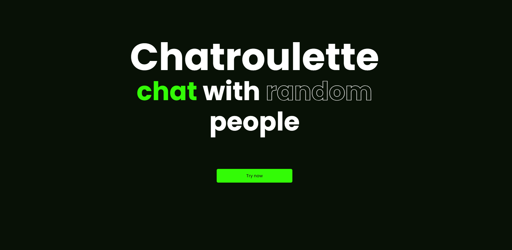
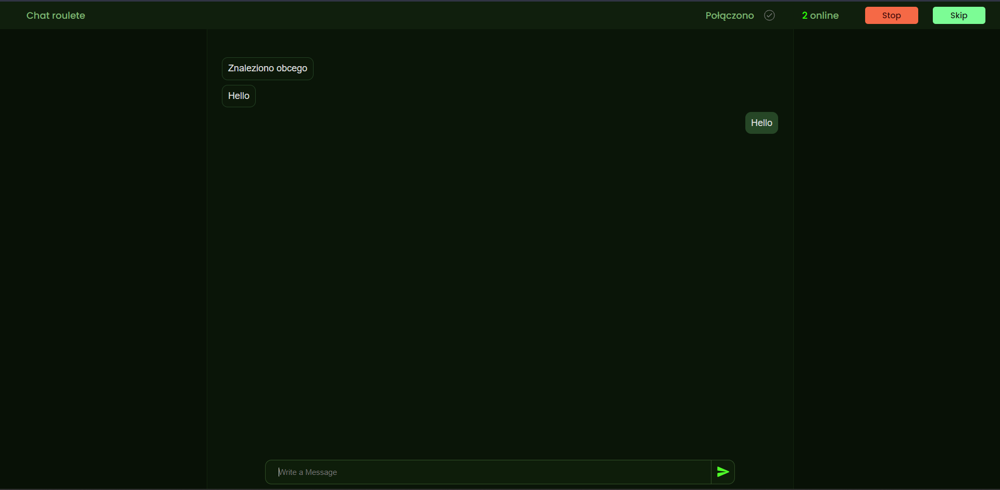

# Chatroulette

Online random person chat





## Run Locally

Clone the project

```bash
git clone github.com/Pla9er9/chat-roulette
```

Go to the project directory

```bash
cd chat-roulette
```

### Run server

Go to web app directory

```bash
cd server
```

Install dependencies

```go
go mod tidy
```

Start the server

```bash
go run .
```


### Run web app

Go to web app directory

```bash
cd app/Chatroulette
```

Install dependencies

```bash
npm install
```

Start the server

```bash
npm run start
```


## License

[MIT](https://choosealicense.com/licenses/mit/)

